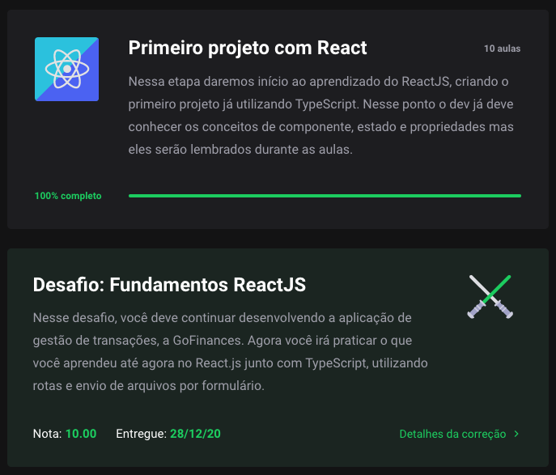
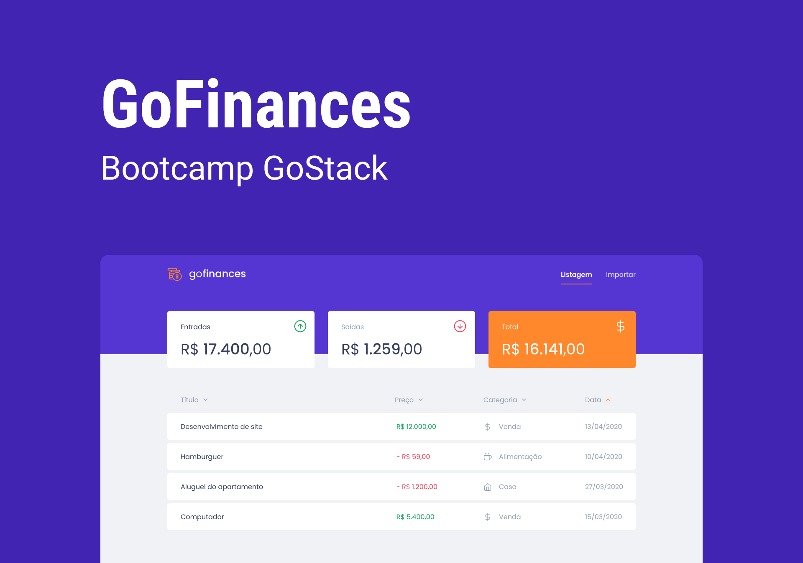

 <div align="center" id="top">
  <p align="center">
  	
  </p>
</div>

 <hr/>

  <h1 align="center"> Fundamentos ReactJS </h1>

<p align="center">
   
   
   
   
   
	
</p>	

<p align="center">
  <a href="#dart-sobre"> Sobre </a> &#xa0; | &#xa0; 
  <a href="#rocket-tecnologias"> Tecnologias </a> &#xa0; | &#xa0;
  <a href="#white_check_mark-requisitos"> Requisitos </a> &#xa0; | &#xa0;
  <a href="#checkered_flag-iniciando"> Iniciando </a> &#xa0; | &#xa0;
  <a href="#bulb-dica"> Dica </a> &#xa0; | &#xa0;
  <a href="#unlock-licença"> Licença </a> &#xa0; | &#xa0;
  <a href="https://www.linkedin.com/in/luiza-lissandra/" target="_blank"> Desenvolvedora </a>
</p>

<br>

## :dart: Sobre ##

<p align="center">
	
</p>

<br>

Este projeto é resultado do meu sexto desafio de código no <a href="https://rocketseat.com.br/gostack">bootcamp Go Stack da Rocketseat. </a> Nele fui desafiada a colocar em prática tudo que aprendi sobre ReactJS com Typescript através da aplicação Go Finances.

:warning:  Este projeto é complementado pelo <a href='https://github.com/LissandraRodrigues/database-upload'> back-end criado no quinto desafio. </a>

 

## :rocket: Tecnologias ##

As seguintes tecnologias foram utilizadas nesse projeto:

- [ReactJS](https://pt-br.reactjs.org/)
- [Typescript](https://www.typescriptlang.org/)

## :white_check_mark: Requisitos ##

Antes de começar :checkered_flag:, você precisa ter o [Git](https://git-scm.com) e o [Node](https://nodejs.org/en/) instalados.

## :checkered_flag: Iniciando ##

```bash
# Clone este projeto.
$ git clone https://github.com/LissandraRodrigues/fundamentos-reactjs

# O acesse.
$ cd fundamentos-reactjs

# Instale as dependências.
$ yarn 

# Execute o projeto.
$ yarn start

```
## :bulb: Dica ##

Utilize o <a href='https://insomnia.rest/'>Insomnia</a>, pois ele é um cliente HTTP que permite fazermos requisições para API sem precisar utilizar um browser.


Use a configuração que eu utilizei através do botão abaixo:

[](https://insomnia.rest/run/?label=Transa%C3%A7%C3%B5es&uri=https%3A%2F%2Fraw.githubusercontent.com%2FLissandraRodrigues%2Fdatabase-upload%2Fmaster%2Fgo-stack-transacoes.json)

## :unlock: Licença ##

Este projeto está sob a licença do MIT. Para saber mais, veja em [LICENSE](LICENSE).

<hr/>

Feito por <a href="https://www.linkedin.com/in/luiza-lissandra/" target="_blank"> Luiza Lissandra :rocket: </a>

&#xa0;

<a href="#top"> Voltar para o início </a>
